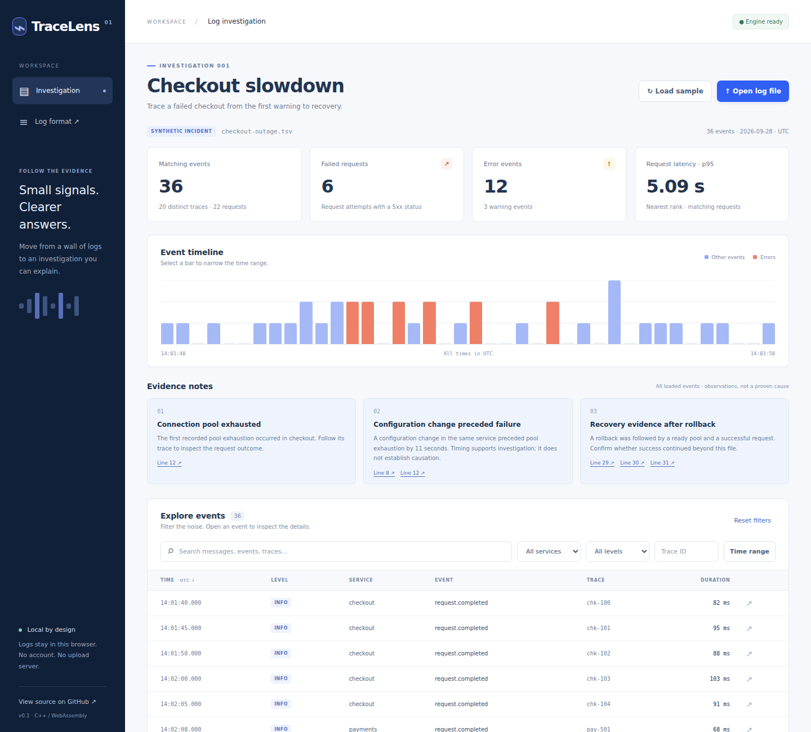
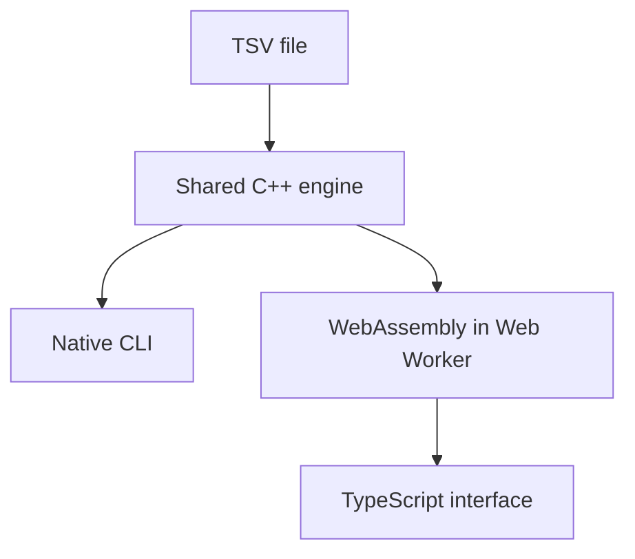

# TraceLens

**Follow the evidence in your logs.** A browser log investigation workspace with a shared C++17 engine, compiled to WebAssembly and also available as a native CLI.

[](https://github.com/VRW311/TraceLens/actions/workflows/verify-and-deploy.yml)

> The live demo is being deployed. See [Actions](https://github.com/VRW311/TraceLens/actions) for the verified build and deployment status.



## The problem

An error line rarely explains an incident. TraceLens connects timing, service changes, request traces, and recovery evidence so someone can explain what the logs actually support.

Open the app and the synthetic checkout incident loads automatically. It contains healthy traffic, a pool configuration change, connection timeouts, repeated failures, and a rollback. No setup or login is needed to explore the demo. Your own files are processed in browser memory by a dedicated Web Worker; TraceLens has no upload API or analytics. The hosting provider still receives normal requests for the application itself.

## Investigate in two minutes

1. Notice **6 failed request attempts**, **12 error events**, and **5.09 s p95** in the 36-event sample.
2. Open **Line 8** under “Configuration change preceded failure.” The pool limit changed from 20 to 2.
3. Open **Line 12** to inspect the first exhausted pool at **14:02:21 UTC**. Choose **Follow this trace** to see warnings, timeouts, and two failed attempts for `chk-104`.
4. Reset filters. Inspect the rollback and recovery evidence on **Lines 29–31**.
5. Filter to `payments`: its three request completions are successful in this sample.

The known synthetic cause is a pool configuration regression. The tool reports a temporal association and recovery evidence, not an automatically proven root cause. [Incident ground truth and limits](docs/sample-incident.md).

## What is implemented

- Strict [TraceLens TSV v1](docs/log-format.md) parsing with source-line diagnostics, UTF-8 validation, and calendar-aware UTC timestamps.
- Stable event ordering; combined service, severity, trace, text, and inclusive time filters.
- Fixed-boundary timeline buckets, request p95, failed-attempt counts, and full-result summaries independent of pagination.
- Evidence notes linked to original source lines; event detail and trace follow-through.
- Local file selection, malformed-row reporting, loading/empty/error states, keyboard-operable controls, and mobile layout.
- The same engine in the native CLI and actual WebAssembly module. No JavaScript parser fallback.

## Architecture



C++ owns parsing, ordering, filtering, statistics, timeline aggregation, findings, and JSON serialization. TypeScript owns presentation and user interaction. Vite builds the interface; GitHub Actions checks both execution targets and deploys the static build to Pages. [Design decisions](docs/architecture.md).

## Build and run

Prerequisites: Git, a C++17 compiler, CMake 3.16+, Node.js 24 with npm, Python 3, and Emscripten **4.0.15**. Linux is exercised in CI; other operating systems have not been verified.

```bash
git clone https://github.com/VRW311/TraceLens.git
cd TraceLens
npm ci

# Native engine and CLI
npm run build:native
npm run test:native
./build/native/tracelens samples/checkout-outage.tsv --service checkout --level ERROR

# Official, pinned Emscripten toolchain
git clone --depth 1 --branch 4.0.15 https://github.com/emscripten-core/emsdk.git .emsdk
./.emsdk/emsdk install 4.0.15
./.emsdk/emsdk activate 4.0.15
source ./.emsdk/emsdk_env.sh
npm run build:wasm
npm run test:wasm

# Interface
npm run build
npm run dev
# Open the URL printed by Vite, including /TraceLens/.
```

The CLI prints JSON with parse diagnostics and the first 50 matching events. Supported options: `--service`, `--level`, `--trace`, `--search`, `--from`, `--to`. Time values use `YYYY-MM-DDTHH:mm:ss.SSSZ`. Exit codes: 0 for a parsed file (possibly with rejected rows), 1 for a fatal format/size error, 2 for invalid arguments or file access.

## Verification

```bash
npm run test:native
npm run test:wasm
npx playwright install chromium
npm run build
npm run test:e2e
```

Locally verified on Linux / Chromium:

| Check | Result |
|---|---|
| C++ semantic contract tests | 20 passed |
| Native vs WebAssembly comparisons | 35 passed |
| WebAssembly binding checks | 3 passed |
| Browser investigation tests | 9 passed |
| TypeScript check and production build | Passed |

The badge above reports the current GitHub Actions result; local results do not imply CI or deployment success. Browser coverage includes evidence links, trace following, combined filters, UTC bounds, pagination, malformed input, HTML-like log text, mobile overflow, and empty files. [Verification details](docs/verification.md).

## Scope and limitations

- One documented TSV format. No arbitrary JSON, syslog, or OpenTelemetry ingestion yet.
- 10 MiB / 50,000 valid events per file; 16 KiB per row. These are enforced safety limits, not performance claims. No throughput benchmark is claimed.
- Invalid rows are skipped and reported (first 100 diagnostic details); fatal input errors clear the dataset.
- Text search folds ASCII case only. Dates are UTC with millisecond precision; no leap seconds.
- Findings use a small set of explicit event-name rules and focus on the first pool-exhaustion incident. Multiple independent incidents need further work.
- A failure count is a count of request attempts, not people. The sample is synthetic and too small to estimate production impact or an SLA.
- Chromium is tested. Firefox and Safari have not yet been verified.
- Logs are held in memory for the current page session. There is no persistence, backend, account system, or AI diagnosis.

## Project history

1. Specify the contract, sample, and expected investigation answers.
2. Build the shared engine and verify native/WebAssembly behavior.
3. Build and test the investigation interface.
4. Automate verification and publish the portfolio demo.

Created with AI assistance. The repository keeps implementation choices, test coverage, and limitations explicit so the work can be reviewed and explained.
